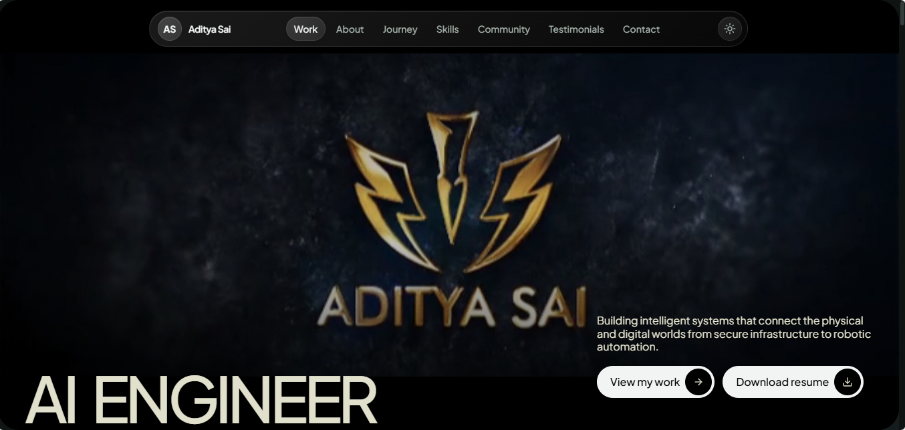

# Personal Portfolio (Next.js)

This repository contains a single-page personal portfolio application built with Next.js App Router, React, TypeScript, Tailwind CSS, GSAP, and Framer Motion.

Live Demo: [aditya-sai.vercel.app](https://aditya-sai.vercel.app/)



## Who This README Is For

This README is written for new developers joining the project. It covers:

- What the app does
- How the codebase is organized
- How data and UI flow work
- How to run, customize, and deploy safely

For deeper references, also read:

- `API_DEVELOPER_DOCS.md`
- `ARCHITECTURE_OVERVIEW.md`

## Current Product Scope

This is currently a **frontend-only portfolio site** with no backend services.

Implemented functionality:

- Floating liquid-glass navigation pill with scroll-aware opacity, active-section tracking, theme toggle, and a clean mobile dropdown
- Hero section with editorial left-aligned layout, a GSAP entrance timeline, and a floating liquid-glass identity panel
- Asymmetric editorial project showcase with a dominant featured piece and a glass metadata panel floating over the image
- About section with a dominant statement, typographic facts, and one floating glass surface
- Experience/education timeline with glass markers
- Skills organized into categories with glass chips (icons from skillicons.dev) plus translucent pills on an atmospheric band
- Certifications as a scannable archive (compact rows, glass filters, hairline separators)
- Community roles as editorial rows with organization logos
- Testimonials section with a stagger-fan card layout featuring real photos, LinkedIn links, and full quotes from colleagues and clients
- About section with a portrait profile photo beside the description
- Contact section with giant display type and a single glass CTA over a luminous atmosphere
- A recurring oversized-typography motif used on three sections for visual rhythm
- Light/dark theme support (morning-light palette / nighttime glass + muted sage accent)
- `prefers-reduced-motion` support

Not currently implemented:

- REST/GraphQL API endpoints
- Database persistence
- Server-side form handling
- Authentication/authorization

## Tech Stack

- Framework: `next` `^15.5.9` (App Router)
- UI: `react` `^18.3.1`, `framer-motion`, `lucide-react`, `next-themes`
- Animation: `gsap` + `@gsap/react` (primary), Framer Motion (small state transitions)
- Styling: `tailwindcss` + custom design tokens (CSS variables, liquid-glass system)
- Font: `Plus Jakarta Sans` (via `next/font`)
- Language: TypeScript (`strict: true`)
- Utilities: `clsx`, `tailwind-merge`
- Deployment target: Vercel/static-friendly hosting

## Project Structure (Actual)

```txt
Portfolio/
+-- app/
|   +-- globals.css               # Design tokens (glass palette) + Tailwind layers + reduced motion
|   +-- layout.tsx                # Root HTML shell + metadata + font + theme provider
|   +-- page.tsx                  # Main single-page composition
+-- components/
|   +-- Atmosphere.tsx            # Fixed blurred color orbs (GSAP slow drift)
|   +-- Navbar.tsx                # Floating liquid-glass pill navigation + theme toggle + mobile menu
|   +-- Hero.tsx                  # Editorial hero with GSAP entrance + glass identity panel
|   +-- Projects.tsx              # Asymmetric project showcase + glass metadata panel
|   +-- About.tsx                 # Dominant statement + portrait profile photo + typographic facts + one glass surface
|   +-- Experience.tsx            # Education/work timeline with glass markers
|   +-- Skills.tsx                # Category rows + glass icon chips (skillicons.dev) + translucent pills
|   +-- Certifications.tsx        # Scannable archive with glass filter pills
|   +-- Community.tsx             # Editorial community role rows
|   +-- Contact.tsx               # Closing statement + glass CTA over luminous atmosphere
|   +-- Footer.tsx                # Minimal footer + glass back-to-top
|   +-- theme-provider.tsx        # next-themes wrapper
|   +-- ui/                       # Design-system primitives (incl. section-word, magnetic, stagger-testimonials) + unused shadcn components
+-- constants/
|   +-- theme.ts                  # Site identity + social links
+-- hooks/
|   +-- use-toast.ts              # Toast state manager (currently not wired to page)
+-- lib/
|   +-- utils.ts                  # `cn()` className merge helper
+-- public/
|   +-- favicon.png
|   +-- resume.pdf
|   +-- hero-video.mp4            # Hero section background video
|   +-- aditya-profile.jpeg       # About section profile photo
|   +-- *.jpeg / *.jpg            # Community organization logos + testimonial photos
|   +-- logos/                    # Skill/tool icons (SVG/PNG)
+-- next.config.js
+-- tailwind.config.ts
+-- tsconfig.json
+-- README.md
```

## End-to-End Runtime Flow

1. `app/layout.tsx` sets up global HTML, font, metadata, and the `next-themes` provider.
2. `app/page.tsx` renders the page tree in this order:
   - `Navbar`
   - `Hero`
   - `Projects` (work)
   - `About`
   - `Experience` (journey)
   - `Skills`
   - `Certifications`
   - `Community`
   - `Contact`
   - `Footer`
3. `Navbar` scrolls to section IDs via `element.scrollIntoView({ behavior: 'smooth' })` and tracks the active section with an `IntersectionObserver`.
4. Scroll reveals use the GSAP-based `Reveal` primitive (ScrollTrigger), which disables itself under `prefers-reduced-motion`.
5. Testimonials render in a stagger-fan card layout (`StaggerTestimonials`) with the center card highlighted and navigation arrows to browse.

## Configuration Notes

- `constants/theme.ts` centralizes site identity (`SITE`) and social links (`SOCIAL_LINKS`).
- `tailwind.config.ts` maps design tokens from CSS variables (glass surfaces, shadows, accent) into Tailwind utilities.
- `app/globals.css` defines the light/dark token sets and the `.glass` / `.glass-subtle` / `.glass-elevated` / `.orb` / `.display` / `.eyebrow` utility classes.
- `next.config.js` currently sets:
  - `eslint.ignoreDuringBuilds: true`
  - `typescript.ignoreBuildErrors: true`
  - `images.unoptimized: true`

These settings are convenient for rapid iteration but reduce production build strictness.

## Setup and Run

1. Install dependencies:

   ```bash
   npm install
   ```

2. Start dev server:

   ```bash
   npm run dev
   ```

3. Open:

   ```txt
   http://localhost:3000
   ```

4. Production build:

   ```bash
   npm run build
   npm run start
   ```

> Note: if your shell exports a non-standard `NODE_ENV` (e.g. `development`), run the build as
> `NODE_ENV=production npm run build` — otherwise Next.js fails while prerendering error pages.

## Developer Scripts

- `npm run dev` — run local development server
- `npm run build` — create production build
- `npm run start` — run production server
- `npm run lint` — run Next.js linting

## Onboarding Guidance for Freshers

Recommended first reading order:

1. `app/page.tsx` (top-level composition)
2. `constants/theme.ts` (global constants)
3. The design-system primitives in `components/ui/`
4. `tailwind.config.ts` + `app/globals.css`
5. `ARCHITECTURE_OVERVIEW.md`
6. `API_DEVELOPER_DOCS.md`

Recommended first tasks:

- Add one new section component and wire it in `app/page.tsx`
- Add one new project entry in `components/Projects.tsx`
- Add one new certification entry in `components/Certifications.tsx`
- Replace the `mailto` CTA flow with a real API endpoint (see API docs)

## Deployment

Typical Vercel flow:

1. Push repository to GitHub.
2. Import repository in Vercel.
3. Build command: `npm run build`
4. Start command: `npm run start` (if needed by host)

Because this app is mostly static-client rendered content, it can also be hosted on other Node-compatible platforms.

## License

This project is licensed under the [MIT License](LICENSE.md).
